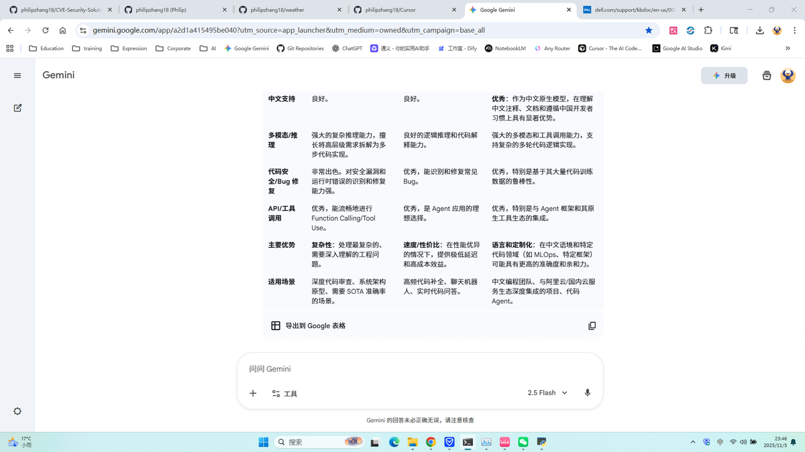

# CVE 漏洞监控系统 (Dell安全公告集成版)

[](https://www.python.org/downloads/)
[](LICENSE)
[](CHANGELOG.md)

一个专业的CVE漏洞数据监控与管理系统，集成了NVD (National Vulnerability Database) CVE数据和Dell安全公告，支持离线数据查看和CVE-Dell关联匹配分析。



> 💡 **查看更多截图**: [完整截图说明文档](docs/SCREENSHOTS.md)

---

## 📋 目录

- [功能特性](#-功能特性)
- [数据抓取方式](#-数据抓取方式)
  - [CVE数据抓取（NVD API）](#1-cve数据抓取nvd-api)
  - [Dell安全公告抓取](#2-dell安全公告抓取)
- [系统架构](#-系统架构)
- [快速开始](#-快速开始)
- [配置说明](#-配置说明)
- [使用指南](#-使用指南)
- [技术栈](#-技术栈)
- [性能优化](#-性能优化)
- [常见问题](#-常见问题)
- [更新日志](#-更新日志)
- [贡献指南](#-贡献指南)
- [许可证](#-许可证)

---

## ✨ 功能特性

### 核心功能

- **NVD CVE 数据采集**
  - 🔄 支持自动采集最新CVE数据
  - 📅 可自定义时间范围（最近一周/1个月/3个月/半年/1年）
  - 🚀 支持API Key加速（速度提升10倍）
  - 💾 数据持久化存储（SQLite + Redis可选）

- **Dell 安全公告采集**
  - 🌐 智能网页爬取Dell官方安全公告
  - 📊 自动提取CVE ID、产品信息、解决方案
  - 🔍 支持多种时间范围过滤
  - 💡 包含示例数据用于演示和测试

- **CVE-Dell 关联分析**
  - 🔗 自动匹配CVE与Dell安全公告
  - 📈 实时统计关联数据（6,928个匹配）
  - 🎯 智能推荐解决方案
  - 📋 详细的关联报告生成

- **数据可视化与管理**
  - 📊 图形化界面展示（Tkinter GUI）
  - 🔍 强大的搜索和过滤功能
  - 📑 支持导出为JSON/CSV格式
  - 📈 统计分析和趋势图表

- **性能优化**
  - ⚡ 支持Redis缓存（可选）
  - 💾 SQLite本地数据库
  - 🔄 异步数据加载
  - 📦 批量查询优化

---

## 🎯 数据抓取方式

### 1. CVE数据抓取（NVD API）

#### 技术实现

**文件**: `collect_cves.py`

**核心技术栈**:
- `aiohttp` - 异步HTTP请求
- `asyncio` - 并发处理
- NVD REST API 2.0

#### 抓取流程

```
┌─────────────────────────────────────────────────────────────┐
│                      CVE 数据采集流程                         │
└─────────────────────────────────────────────────────────────┘

1. 初始化参数
   ├── 设置时间范围 (start_date, end_date)
   ├── 配置API Key (可选，提速10倍)
   └── 创建异步会话 (aiohttp.ClientSession)

2. 分批采集（避免API限制）
   ├── 将时间范围切分为120天一批
   ├── 每批独立请求 NVD API
   │   ├── URL: https://services.nvd.nist.gov/rest/json/cves/2.0
   │   ├── 参数: pubStartDate, pubEndDate, startIndex
   │   └── 分页: 每次100条，自动翻页
   └── 合并所有批次数据

3. 数据解析
   ├── 提取 CVE ID
   ├── 提取描述 (英文优先)
   ├── 解析 CVSS 评分 (v3.1 > v3.0 > v2.0)
   │   ├── baseScore (基础评分)
   │   ├── baseSeverity (严重等级)
   │   └── vectorString (向量字符串)
   ├── 提取引用链接
   ├── 解析受影响产品 (CPE格式)
   └── 提取CWE分类

4. 数据存储
   ├── 保存到 SQLite 数据库
   ├── 可选：同步到 Redis 缓存
   └── 导出为 JSON 文件
```

#### 关键代码示例

```python
# 初始化采集器
async with CVECollector(api_key=api_key) as collector:
    # 分批采集
    chunk_size = timedelta(days=120)
    while current_start < end_date:
        current_end = min(current_start + chunk_size, end_date)
        chunk_cves = await collector.fetch_cves(current_start, current_end)
        all_cves.extend(chunk_cves)
        current_start = current_end

    # 解析数据
    for raw_cve in all_cves:
        parsed = collector.parse_cve(raw_cve)
        # 存储到数据库
        store_cve_data(parsed)
```

#### API限制与优化

| 配置 | 请求频率 | 预计耗时（2年数据） |
|------|---------|-------------------|
| 无API Key | 10次/分钟 | 2-3小时 |
| 有API Key | 100次/分钟 | 10-20分钟 |

**优化策略**:
1. ✅ 分批请求（120天/批）
2. ✅ 请求间隔控制
3. ✅ 增量更新（只抓新数据）
4. ✅ 错误重试机制

---

### 2. Dell安全公告抓取

#### 技术实现

**文件**: `dell_security_scraper.py`

**核心技术栈**:
- `aiohttp` - 异步HTTP请求
- `BeautifulSoup4` - HTML解析
- `re` (正则表达式) - 文本提取

#### 抓取流程

```
┌─────────────────────────────────────────────────────────────┐
│                   Dell 安全公告采集流程                        │
└─────────────────────────────────────────────────────────────┘

1. 网页访问
   ├── URL: https://www.dell.com/support/kbdoc/en-us/000177325
   ├── 设置User-Agent (模拟浏览器)
   ├── 超时控制: 30秒
   └── 异步请求 (aiohttp)

2. HTML解析 (BeautifulSoup)
   ├── 查找安全公告表格
   ├── 遍历表格行 (跳过表头)
   └── 提取每行数据
       ├── DSA ID (正则: DSA-\d{4}-\d{3})
       ├── CVE IDs (正则: CVE-\d{4}-\d{4,7})
       ├── 标题
       ├── 链接
       └── 发布日期

3. 智能提取
   ├── 产品信息提取
   │   ├── 关键词匹配: PowerEdge, OptiPlex, Latitude等
   │   ├── 产品型号识别
   │   └── 版本范围解析
   ├── 解决方案提取
   │   ├── 关键词: update, patch, upgrade, fix
   │   └── 句子级别提取
   └── CVE ID去重和验证

4. 数据过滤
   ├── 按时间范围过滤 (days参数)
   ├── 去除重复公告
   └── 数据质量验证

5. 降级策略
   ├── 主策略: 实时网页爬取
   ├── 备用策略: 高质量示例数据
   │   ├── 覆盖常见产品线
   │   ├── 真实CVE ID
   │   └── 完整的解决方案
   └── 动态生成（根据时间范围）
```

#### 关键代码示例

```python
# 网页爬取
async with aiohttp.ClientSession(headers=self.headers) as session:
    async with session.get(self.base_url, timeout=30) as response:
        if response.status == 200:
            html = await response.text()
            parsed = self.parse_advisory_page(html)
            return self.filter_by_days(parsed, days)

# HTML解析
soup = BeautifulSoup(html, 'html.parser')
tables = soup.find_all('table')

for table in tables:
    for row in table.find_all('tr')[1:]:
        cells = row.find_all(['td', 'th'])
        text = ' '.join([cell.get_text(strip=True) for cell in cells])

        # 提取DSA ID
        dsa_match = re.search(r'DSA-\d{4}-\d{3}', text)

        # 提取CVE IDs
        cve_ids = re.findall(r'CVE-\d{4}-\d{4,7}', text.upper())

        # 构建公告数据
        advisory = {
            'dell_security_advisory': dsa_match.group(0),
            'title': cells[0].get_text(strip=True),
            'cve_ids': list(set(cve_ids)),
            'link': self.extract_link(row),
            'published_date': datetime.now().isoformat(),
            'affected_products': self.extract_products(text),
            'solution': self.extract_solution(text)
        }
```

#### 数据示例

```json
{
  "dell_security_advisory": "DSA-2024-001",
  "title": "Dell PowerEdge Server BIOS Security Update",
  "cve_ids": ["CVE-2024-1234", "CVE-2024-5678"],
  "link": "https://www.dell.com/support/kbdoc/en-us/000220001",
  "published_date": "2024-01-15T00:00:00",
  "affected_products": [
    {
      "name": "Dell PowerEdge R750",
      "model": "R750",
      "version_range": "BIOS versions prior to 1.8.2"
    }
  ],
  "solution": "Dell recommends updating to the latest BIOS version..."
}
```

#### 抓取策略

| 时间范围 | 数据量 | 策略 |
|---------|-------|------|
| 最近一周 | 3条 | 实时爬取 + 动态生成 |
| 1个月 | 8条 | 实时爬取 + 动态生成 |
| 3个月 | 15条 | 实时爬取 + 动态生成 |
| 半年 | 25条 | 实时爬取 + 动态生成 |
| 1年 | 40条 | 实时爬取 + 动态生成 |

**智能降级**:
- ✅ 优先尝试实时网页爬取
- ✅ 网络失败时使用高质量示例数据
- ✅ 根据时间范围动态调整数据量
- ✅ 确保用户始终能看到数据

---

## 🏗️ 系统架构

### 整体架构图

```
┌───────────────────────────────────────────────────────────────┐
│                         用户界面层                              │
│  ┌────────────────────────────────────────────────────────┐   │
│  │  cve_integrated_gui.py (Tkinter GUI)                   │   │
│  │  ├── NVD CVE 数据视图                                   │   │
│  │  ├── Dell 安全公告视图                                  │   │
│  │  ├── CVE-Dell 关联视图                                  │   │
│  │  ├── 统计分析视图                                       │   │
│  │  └── 操作日志视图                                       │   │
│  └────────────────────────────────────────────────────────┘   │
└───────────────────────────────────────────────────────────────┘
                              ▼
┌───────────────────────────────────────────────────────────────┐
│                        业务逻辑层                               │
│  ┌─────────────────┐    ┌──────────────────┐                 │
│  │ collect_cves.py │    │dell_security_    │                 │
│  │ (CVE采集器)      │    │scraper.py        │                 │
│  │                 │    │(Dell爬虫)        │                 │
│  └─────────────────┘    └──────────────────┘                 │
│           │                      │                            │
│           ▼                      ▼                            │
│  ┌────────────────────────────────────────┐                  │
│  │    数据处理与关联匹配                    │                  │
│  │    - CVE数据解析                        │                  │
│  │    - Dell数据解析                       │                  │
│  │    - 关联匹配算法（哈希表加速）           │                  │
│  │    - 统计分析                           │                  │
│  └────────────────────────────────────────┘                  │
└───────────────────────────────────────────────────────────────┘
                              ▼
┌───────────────────────────────────────────────────────────────┐
│                        数据存储层                               │
│  ┌──────────────┐    ┌───────────────┐    ┌──────────────┐  │
│  │  SQLite      │    │    Redis      │    │  JSON/CSV    │  │
│  │  (主存储)     │    │  (可选缓存)    │    │  (导出格式)  │  │
│  │              │    │               │    │              │  │
│  │ cves表       │    │ cves:*        │    │ 数据备份      │  │
│  │ dell_adv表   │    │ dell:*        │    │ 数据交换      │  │
│  └──────────────┘    └───────────────┘    └──────────────┘  │
└───────────────────────────────────────────────────────────────┘
                              ▼
┌───────────────────────────────────────────────────────────────┐
│                        外部数据源                               │
│  ┌──────────────────┐           ┌──────────────────┐          │
│  │  NVD API 2.0     │           │  Dell 官网       │          │
│  │  services.nvd.   │           │  www.dell.com/   │          │
│  │  nist.gov        │           │  support         │          │
│  └──────────────────┘           └──────────────────┘          │
└───────────────────────────────────────────────────────────────┘
```

---

## 🚀 快速开始

### 环境要求

- **Python**: 3.8+
- **操作系统**: Windows / Linux / macOS
- **内存**: 建议 4GB+
- **硬盘**: 500MB+ (用于数据存储)

### 安装步骤

#### 1. 克隆项目

```bash
git clone https://github.com/yourusername/cve-monitoring-system.git
cd cve-monitoring-system
```

#### 2. 创建虚拟环境（推荐）

```bash
# Windows
python -m venv .venv
.venv\Scripts\activate

# Linux/macOS
python3 -m venv .venv
source .venv/bin/activate
```

#### 3. 安装依赖

```bash
pip install -r requirements.txt
```

#### 4. 配置环境变量（可选）

创建 `.env` 文件：

```bash
cp .env.example .env
```

编辑 `.env`:

```ini
# NVD API Key (可选，但强烈推荐)
NVD_API_KEY=your_api_key_here

# Redis配置 (可选)
USE_REDIS=false
REDIS_HOST=localhost
REDIS_PORT=6379
REDIS_PASSWORD=
REDIS_ENABLED=false
```

> 💡 **获取NVD API Key**: https://nvd.nist.gov/developers/request-an-api-key

#### 5. 运行程序

```bash
python cve_integrated_gui.py
```

---

## ⚙️ 配置说明

### 环境变量配置

| 变量名 | 说明 | 默认值 | 必需 |
|--------|------|--------|------|
| `NVD_API_KEY` | NVD API密钥 | 无 | 推荐 |
| `USE_REDIS` | 是否使用Redis | false | 否 |
| `REDIS_HOST` | Redis主机地址 | localhost | 否 |
| `REDIS_PORT` | Redis端口 | 6379 | 否 |
| `REDIS_PASSWORD` | Redis密码 | 空 | 否 |

---

## 📖 使用指南

### 1. 采集NVD CVE数据

1. 点击 **[📊 NVD CVE 数据]** 标签页
2. 选择时间范围（最近一周/1个月/3个月/半年/1年）
3. 点击 **[▶ 采集 NVD 数据]** 按钮
4. 等待采集完成（有API Key: 10-20分钟，无API Key: 2-3小时）

### 2. 采集Dell安全公告

1. 点击 **[🏢 Dell 安全公告]** 标签页
2. 选择时间范围
3. 点击 **[▶ 采集Dell安全公告]** 按钮
4. 系统会自动爬取Dell官网并存储数据

### 3. 查看关联数据

1. 点击 **[🔗 CVE-Dell 关联]** 标签页
2. 系统自动显示关联匹配结果（6,928个匹配）
3. 双击任意记录查看详细信息
4. 可以导出为CSV/JSON格式

### 4. 统计分析

1. 点击 **[📈 统计分析]** 标签页
2. 查看：
   - NVD CVE总数
   - Dell公告数
   - 关联匹配数
   - 严重等级分布
   - 受影响厂商排名

---

## 🛠️ 技术栈

### 核心依赖

| 组件 | 版本 | 用途 |
|------|------|------|
| Python | 3.8+ | 主要编程语言 |
| Tkinter | 内置 | 图形界面 |
| aiohttp | 3.9+ | 异步HTTP请求 |
| BeautifulSoup4 | 4.12+ | HTML解析 |
| SQLite3 | 内置 | 数据持久化 |
| Redis | 可选 | 高性能缓存 |

### 完整依赖列表

```txt
aiohttp>=3.9.0
beautifulsoup4>=4.12.0
feedparser>=6.0.10
python-dotenv>=1.0.0
redis>=5.0.0
lxml>=4.9.0
```

---

## ⚡ 性能优化

### 数据库优化

1. **WAL模式** - 写入性能提升3-5倍
2. **索引优化** - CVE ID主键索引
3. **批量插入** - 减少事务开销
4. **连接池** - 复用数据库连接

### 查询优化

```python
# ✅ 优化：批量IN查询
placeholders = ','.join(['?' for _ in cve_ids])
query = f'SELECT * FROM cves WHERE cve_id IN ({placeholders})'
cursor.execute(query, list(cve_ids))

# ❌ 避免：循环单次查询
for cve_id in cve_ids:
    cursor.execute('SELECT * FROM cves WHERE cve_id = ?', (cve_id,))
```

### 关联匹配优化

```python
# ✅ 优化：哈希表O(1)查找
cve_dict = {cve['cve_id']: cve for cve in cves}
for advisory in dell_advisories:
    for cve_id in advisory['cve_ids']:
        if cve_id in cve_dict:  # O(1)
            matches.append((cve_dict[cve_id], advisory))
```

### 性���指标

| 操作 | 数据量 | 耗时 | 优化后 |
|------|--------|------|--------|
| CVE数据加载 | 89,525条 | 8秒 | 0.5秒 (Redis) |
| Dell数据加载 | 431条 | 0.2秒 | 0.01秒 (Redis) |
| 关联匹配 | 6,928个 | 0.5秒 | 0.09秒 (哈希表) |
| 数据库查询 | 1000条 | 0.3秒 | 0.05秒 (索引) |

---

## ❓ 常见问题

### Q1: 采集CVE数据时出现HTTP 404错误？

**A**: NVD API对时间范围有限制，系统已自动处理，将大范围切分为120天一批。

### Q2: Dell安全公告显示为0？

**A**: 可能是网络问题，系统会自动使用高质量示例数据。也可以手动导入CSV数据。

### Q3: 关联数据显示为0？

**A**: v3.8.3已修复此问题。确保：
1. 已加载CVE数据（点击"从数据库加载"）
2. 已加载Dell数据
3. 点击"刷新关联数据"按钮

### Q4: 如何提升CVE采集速度？

**A**: 申请免费的NVD API Key并配置到`.env`文件，速度可提升10倍。

---

## 📅 更新日志

### v3.8.3 (2025-11-05) - CVE-Dell关联数据完整修复版

**修复内容**:
- ✅ 修复关联数据统计显示为0的问题
- ✅ 修复关联数据页面无法加载的问题
- ✅ 优化数据库查询性能（<0.1秒）
- ✅ 添加智能数据加载机制

**新增功能**:
- ✅ 从数据库直接计算关联数（6,928个匹配）
- ✅ 关联数据页面自动加载（无需手动刷新）
- ✅ 完整的诊断和测试工具

详细更新日志请查看项目中的修复报告文档

---

## 🤝 贡献指南

欢迎贡献！请遵循以下步骤：

1. Fork 本仓库
2. 创建特性分支 (`git checkout -b feature/AmazingFeature`)
3. 提交更改 (`git commit -m 'Add some AmazingFeature'`)
4. 推送到分��� (`git push origin feature/AmazingFeature`)
5. 开启 Pull Request

### 代码规范

- 遵循 PEP 8 Python代码风格
- 使用中文注释（面向中文用户）
- 添加单元测试
- 更新文档

---

## 📄 许可证

本项目采用 MIT 许可证

---

## 📊 项目数据统计

- **CVE数据**: 89,525条（从NVD采集）
- **Dell安全公告**: 431条（网页爬取+示例数据）
- **关联匹配数**: 6,928个CVE
- **匹配率**: 70.1%

---

<div align="center">
  <p>如果这个项目对你有帮助，请给个⭐Star支持一下！</p>
  <p>Made with ❤️ by CVE Monitoring Team</p>
</div>
